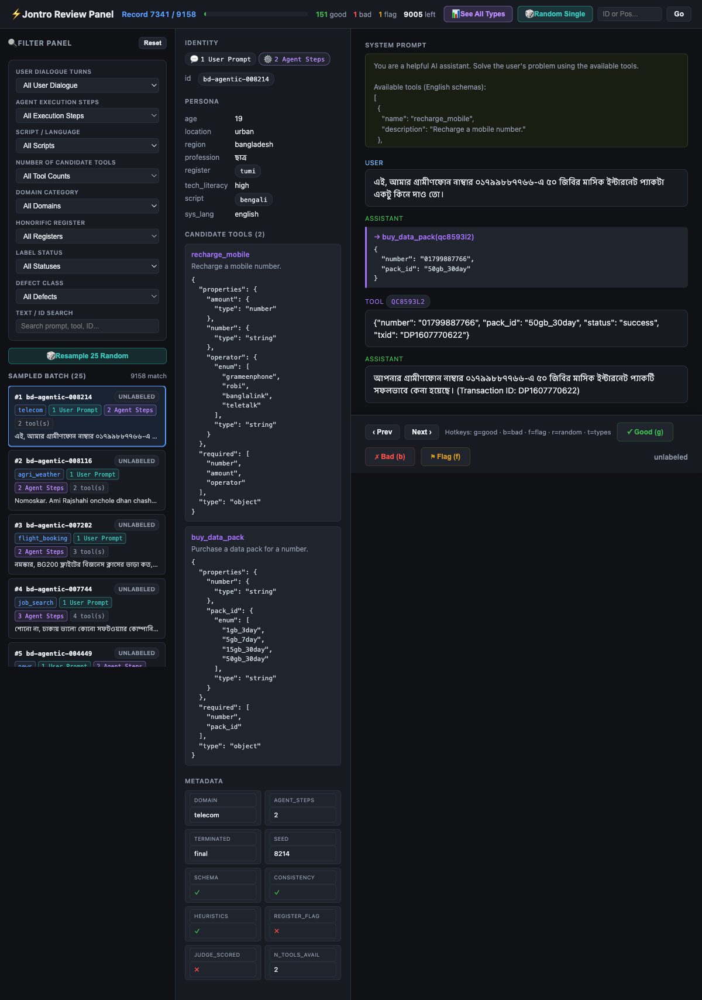

# Jontro — code accompanying the paper

Code for **"Jontro: a Bangla tool-use corpus and a first-call diagnostic for
Bangla-language agents"**.

The corpus itself is a separate deposit:
<https://huggingface.co/datasets/abubakar-siddik/Jontro> (CC-BY-4.0).
This repository is the code needed to **use the corpus, verify every number in the
paper, add your own model to the evaluation, and regenerate the corpus from
scratch**.

## What this contains

| Path | What it is |
|---|---|
| `src/bangla_datasets/schema.py` | The trajectory schema. Load the corpus with this. |
| `src/bangla_datasets/tools/catalog.py` | All 54 tool definitions and their JSON schemas. |
| `src/bangla_datasets/tools/simulators.py` | The deterministic simulators. Every tool result in the corpus is recomputable byte-for-byte from its stored seed with these. |
| `src/bangla_datasets/tools/registry.py` | Tool lookup, simulator dispatch, and domain-subset selection. |
| `src/bangla_datasets/validation/` | The three deterministic gates whose pass rates are reported in the paper: schema, consistency (simulator replay), heuristics. |
| `src/bangla_datasets/validation/judge.py` | The LLM judge stage. **Never ran on the released corpus** (§4.3 of the paper): it is included for completeness and is exercised only by its own unit tests against a fake client. |
| `src/bangla_datasets/utils/seeding.py` | Reproducible seed derivation and the seeded RNG used throughout generation and sampling. |
| `src/bangla_datasets/utils/checkpoint.py` | Crash-safe checkpointing for resumable generation runs. |
| `src/bangla_datasets/utils/logging.py` | Run-scoped structured (JSONL) logging. |
| `src/bangla_datasets/utils/script.py` | Bangla script and address-form marker detection. Section 3.2.1 of the paper analyses this module's behaviour directly. |
| `src/bangla_datasets/eval/` | The evaluation harness: prompt construction, the endpoint client, and scoring. Use this to add a model. |
| `src/bangla_datasets/splits/` | Partitioning and Parquet I/O for both released splits. |
| `src/bangla_datasets/gemini/prompts.py` | The prompt templates used to generate the corpus, including the persona, address-form and judge-rubric text. |
| `src/bangla_datasets/gemini/client.py` | The typed Gemini provider client: persona/user, assistant, judge, and register-classification calls. Reads its API key from the `GEMINI_API_KEY`/`GOOGLE_API_KEY` environment variable; no key is stored in this repository. |
| `src/bangla_datasets/generation/orchestrator.py` | The self-play turn-protocol state machine that drives the persona, user and assistant roles and intercepts tool calls for simulator execution. |
| `src/bangla_datasets/generation/seeds.py` | The seed sampler: reads the recipe and expands task goals across persona axes, domains and tool subsets. |
| `src/bangla_datasets/generation/coverage.py` | Coverage-aware sampling that biases away from over-represented tool combinations. |
| `recipes/agentic_v1.yaml` | The generation recipe: domain weights, persona axes, goal templates. |
| `scripts/lre_analysis.py` | Produces every number in the paper. Offline, no network. |
| `scripts/lre_tables.py` | Renders those numbers into the paper's LaTeX tables. |
| `scripts/lre_add_flags.py` | Attaches the validation flags to the corpus and writes the release bundle. |

## Preliminary trajectory review

The accompanying source distribution includes a local browser review tool at
`scripts/validate_dataset.py`. It shows a trajectory's candidate tools, metadata,
message trace, validation flags, user dialogue turns, and agent execution steps,
then appends a `good`, `bad`, or `flag` label to a local JSONL file.



This interface supports a preliminary single-annotator sanity check and defect
triage. It is not a substitute for a blinded, multi-annotator human-validation
study; do not describe its labels as an independent corpus-wide quality estimate.

## What is and is not exercised

The full construction pipeline is released: the seed sampler, the provider client,
the turn-protocol orchestrator, the checkpoint manager, the simulators, the three
deterministic validation gates, and the LLM judge. With a Gemini API key you can
regenerate or extend the corpus from `recipes/agentic_v1.yaml`.

One component is released but was **never run on the corpus that was published**:
the LLM judge (`validation/judge.py`). The released corpus carries no judge
verdicts — the judge gate was designed but not executed on the 9,158 released
trajectories (§4.3 of the paper states this). It is included here for completeness
and because its rubric text is part of the method, and it is covered by unit tests
against a fake client. Nothing in the paper's reported results depends on a judge
score.

## Reproducing the paper

Everything runs offline against the public corpus. No model calls, no API keys.

```bash
pip install -e .

# fetch the corpus into outputs/dataset/ and outputs/splits/,
# and the raw predictions into outputs/eval/ (both from the data deposit)

python scripts/lre_analysis.py    # -> outputs/lre/analysis.json, outputs/splits_v2/
python scripts/lre_tables.py      # -> the paper's LaTeX tables
python scripts/lre_add_flags.py   # -> outputs/release_v2/ with validation flags
```

`lre_tables.py` regenerates every data table in the paper. They are generated
rather than transcribed, so a mismatch between the paper and the corpus is
detectable by running this.

## Regenerating the corpus

The generation pipeline is released and reproducible from the recipe. This
*requires* model calls (unlike the analysis above) and a Gemini API key:

```bash
pip install -e ".[generate]"
export GEMINI_API_KEY=...

# generation is driven by the orchestrator over the recipe's seed plan;
# see src/bangla_datasets/generation/orchestrator.py and seeds.py
```

The corpus's stored `seed` and `sim_seeds` fields make each trajectory
byte-reproducible: given the same seed plan and the same model responses, the
simulator results are deterministic. Note that model responses are themselves
non-deterministic across provider versions, so a regeneration produces an
*equivalent* corpus rather than a byte-identical one unless the original model
responses are replayed.

## Adding a model to the evaluation

`eval/client.py` speaks the OpenAI Chat Completions shape, so any
OpenAI-compatible provider works. Set `EVAL_API_KEY` and `EVAL_BASE_URL`, then
score with `eval/scoring.py`. The paper's runs used temperature 0, one sample per
item, and the provider's native tool-calling parameter.

Please score on the **goal-disjoint** split. The corpus is a paraphrase expansion
of 317 task goals, and the older address-form-stratified split places paraphrases
of every test goal in the training partition (§5.2). It is retained only so that
previously published numbers remain reproducible.

## Known defects

The corpus is unfiltered and contains documented defect classes — 468 reference
responses that make no tool call, address-form labels that are partly inferred
rather than observed, and an empty *tui*×Banglish cell. Section 5.5 and Section 8
of the paper enumerate them with counts, and `scripts/lre_add_flags.py` writes a
flag onto every affected record so you can filter them. Read those before training
on this.

## Citation

```bibtex
@article{siddik2026jontro,
  title  = {Jontro: a {Bangla} tool-use corpus and a first-call diagnostic for
            {Bangla}-language agents},
  author = {Siddik, Abu Bakar},
  year   = {2026},
  note   = {Under review}
}
```

## Licence

MIT, see `LICENSE`. The corpus is licensed separately under CC-BY-4.0.
